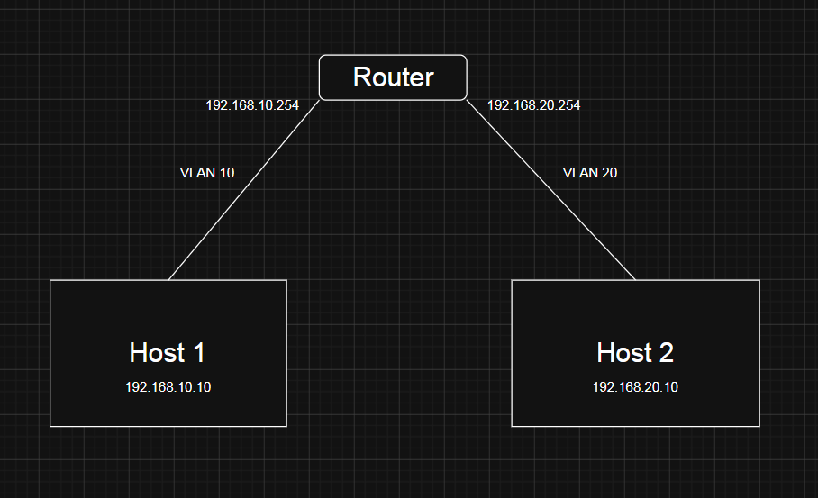

# Different-LANs-simulation-in-Docker
## Overview:
Simulates connection between two LANs in Docker using containers:
- 2 hosts in different LANs
- 1 router connecting them
## Topology:

## What I learn:
- Linux Networking
- Docker compose
## Project structure:
- docker-compose.yml
- router.sh
- host_1.sh
- host_2.sh
## How to run
```bash
docker compose up -d
```
Configure router:
```bash
docker exec -it router sh
sh /router.sh
```
Configure host 1:
```bash
docker exec -it host_1 sh
sh /host_1.sh
```
Configure host 2:
```bash
docker exec -it host_2 sh
sh /host_2.sh
```
